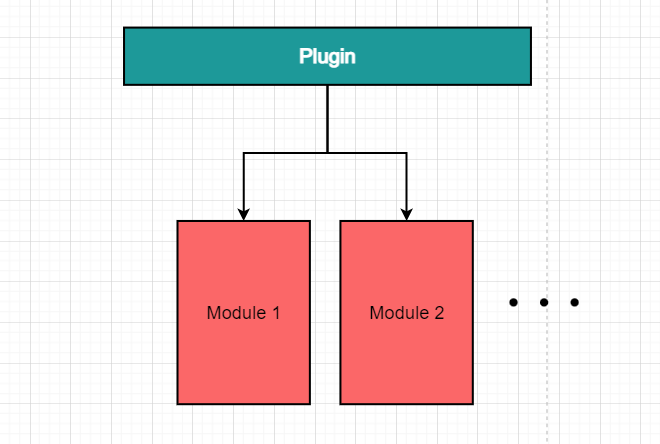

# Squick

## Squick是什么?

Squick是一款可快速开发拓展的游戏服务器开发框架，轻量，插件化，易拓展。目前正在极速开发Unity客户端SDK中，客户端Demo: [Uquick](https://github.com/i0gan/Uquick)

**讨论QQ群：729054809**

Bilibili: https://www.bilibili.com/video/BV1kR4y197Xf


## 特性

- 易使用，采用。
- 采用动态连链接库方式动态加载插件，开发拓展插件，让开发服务器变成开发插件
- 遵守谷歌C++编程规范
- 事件和属性驱动，让开发变得更简单
- Excel实现服务端配置
- 日志捕获系统
- 支持部分不用停服即可热更，动态实现替换插件
- 默认拥有服务器插件：代理服务器、世界服务器、导航系统、数据库服务器、中心服务器、登录服务器

## 将来要做


- 将文档补充
- 增加KCP协议的支持
- 增加世界服务器的逻辑判断
- 接入腾讯云SDK
- 增加后台管理插件
- Protobuf静态解析全部升级为动态解析

## Squick核心架构

程序结构


采用加载不同插件方式来实现不同服务功能，都可适合小、中、大型团队人员进行同时开发，各自只需将自己的功能封装到自己的插件里，通过模块接口实现跨插件调用，提高开发效率。

插件与模块



每一个插件为一个动态链接库文件（.so文件），将功能代码封装为插件的模块，可通过插件来加载各个插件的功能模块。

每个插件可以包含一个或多个模块

## 项目结构

```
build:       // 编译文件
    cache:   // 编译时的中间文件
    config:  // 服务端配置文件
    data:    // 服务程序储存数据目录
    server:  // 服务端程序目录
src:         // 源码
    server:  // 各服务器代码
    squick:  // suiqck核心代码
    tools:   // 工具代码
    tutorial: // 教学代码
docs:         // 文档
third_party:  // 第三方代码
```


## 编译程序文件结构

```
bin/
├── lib
│   ├── libprotobuf.so.32
│   ├── squick_core.so
│   └── squick_struct.so
├── myeasylog.log
├── plugin
│   ├── core
│   │   ├── actor.so
│   │   ├── config.so
│   │   ├── kernel.so
│   │   ├── log.so
│   │   ├── navigation.so
│   │   ├── net.so
│   │   ├── nosql.so
│   │   ├── security.so
│   │   └── test.so
│   └── server
│       ├── db
│       │   ├── client.so
│       │   ├── logic.so
│       │   └── server.so
│       ├── game
│       │   ├── client.so
│       │   ├── logic.so
│       │   └── server.so
│       ├── login
│       │   ├── client.so
│       │   ├── http_server.so
│       │   ├── logic.so
│       │   └── server.so
│       ├── master
│       │   ├── http_server.so
│       │   ├── logic.so
│       │   └── server.so
│       ├── misc
│       │   ├── chat.so
│       │   ├── consume_manager.so
│       │   └── inventory.so
│       ├── proxy
│       │   ├── client.so
│       │   ├── logic.so
│       │   └── server.so
│       └── world
│           ├── client.so
│           └── server.so
└── squick
```


## 快速开始

```bash
git clone https://github.com/pwnsky/squick.git

cd squick
bash install.sh
```


如果不能编译，可能是缺少依赖，打开third_party/install.sh 里查看需要安装的依赖。

编译

```bash
./build.sh
```
编译成功后，可执行文件在 ./build/server/squick


### 搭建Redis
这里采用docker来进行搭建
```
docker pull redis
docker run --name squick-cache -p 22222:6379  -d redis --requirepass pwnsky # pwnsky 是密码
```

测试

```bash
cd ./build
./debug.sh
```


## 开发教学

文档正在极速更新中

### 快速开始

[下载编译]

[快速搭建]

### 知识概念

[基本介绍]

[代码风格框架]

[插件和模块]

[热数据属性]

[数据驱动编程]

[异步机制]

[服务器架构]

[聊天服务器]

[主服务器]

[代理服务器/网关服务器]

[登录服务器]

[数据库服务器]

[游戏服务器]

[世界服务器]

[场景机制]

[lua脚本]

[热重载原理]

[状态同步原理]

[帧同步原理]

[网络协议]

[导航原理]

[服务器配置文件]

[日志配置文件]

[工具]


### 代码实例

[如何编写新的插件]

[如何使用属性机制]

[如何使用事件机制]

[如何使用异步机制]

[如何写http服务器]

[如何调用redis接口]

### 开发调试

[如何正确利用日志快速调试]


## 运营管理

[如何管理Squick进程]

[如何实现热重载]

[如何实现热更新]

[如何实现热更新]


### 客户端SDK

进入 https://github.com/i0gan/Uquick 查看详情安装


## 第三方库

- minzip
- zlib
- easylogging++
- libevent
- hiredis
- protobuf
- RapidXML
- ajson
- concurrentqueue
- navigation
- nlohmann


## 本项目开发环境

### Arch linux
    gcc/g++ version 12.2.0 (GCC)
    cmake version 3.24.2
    Docker version 20.10.18, build b40c2f6b5d
    git version 2.37.3
    /lib/libc.so.6: GNU C Library (GNU libc) stable release version 2.36.

### Ubuntu 20.04

 ```
 gcc/g++ version 9.4.0 (Ubuntu 9.4.0-1ubuntu1~20.04.1)
 cmake version 3.16.3
 /lib/x86_64-linux-gnu/libc.so.6: GNU C Library (Ubuntu GLIBC 2.31-0ubuntu9.9) stable release version 2.31.
 ```

