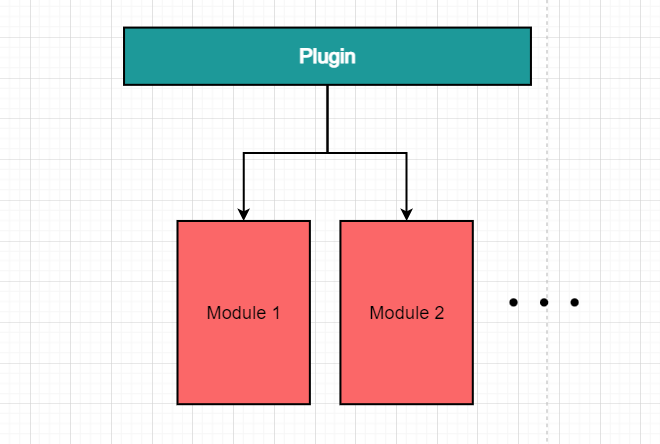
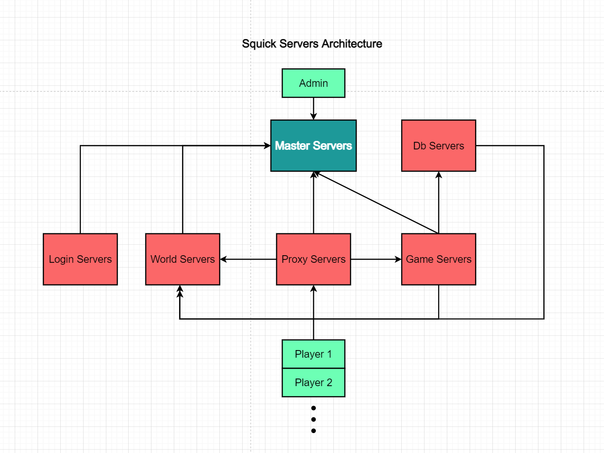

# Squick的基本知识

## 项目结构

该工程项目结构如下：

```
deploy:       // 服务端部署文件夹    
    config:   // 服务端配置文件
    data:     // 服务程序储存数据目录
    bin:      // 服务端程序目录
    lua:      // lua脚本目录
src:          // 源码
    server:   // 各服务器代码
    squick:   // suiqck核心代码
    tools:    // 工具代码
    tutorial: // 教学示例代码
docs:         // 文档
third_party:  // 第三方代码
cache:        // 编译时的临时文件
admin:        // 后台客户端vue源码
others:       // 其他
```


## 代码命名规范

遵循google c++开发规范。


## 插件系统

Squick当前所有重要插件如下：


插件与模块的关系



每一个插件为一个动态链接库文件（.so文件），将功能代码封装为插件的模块，可通过插件来加载各个插件的功能模块。

每个插件可以包含一个或多个模块


## 服务器架构




## 热重载基本原理


## 插件状态调用顺序

``` 
SquickPluginLoad -> Install -> Uninstall -> SquickPluginUnload
```

## 模块状态调用顺序

```
构造函数 -> Start -> AfterStart -> Update -> Destory -> 析构函数
```

